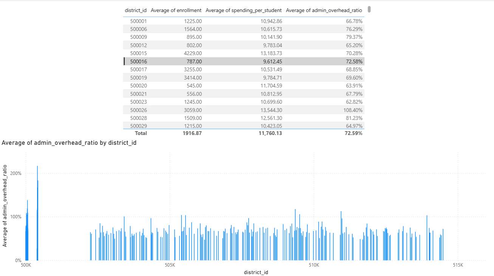
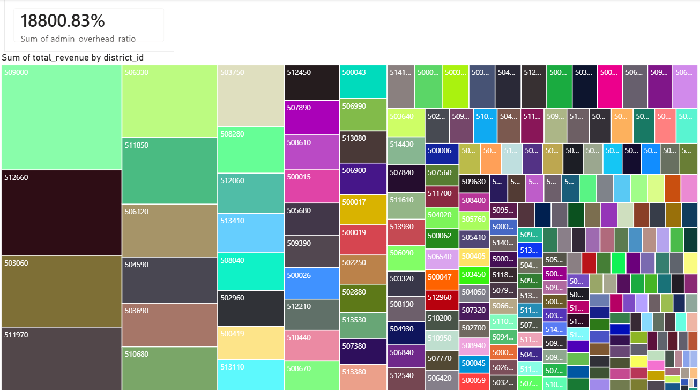

# Arkansas Public School Financial Systems Analytics

## Independent Multi-District System Engineering & Resource Allocation Analysis

### Project Initiative

I engineered this platform to perform an independent fiscal integrity audit on public education spending across the State of Arkansas. Public sector budgeting is notoriously difficult to track across hundreds of individual jurisdictions, so I designed an automated data pipeline to isolate where capital is being deployed efficiently and where fixed administrative structures are creating massive overhead friction.

By targeting raw datasets mirroring the federal National Center for Education Statistics (NCES) Common Core of Data, this platform ingests, standardizes, and stores operational metrics to answer a fundamental question: How much public funding actually makes it into direct classroom instruction versus executive support services?

### Core Analytical Discoveries
1. Structural Administrative Overhead Extremes

When evaluating the administrative-to-instructional overhead ratios across the dataset, the baseline behavior across the state typically hovers around a high but relatively stable 60% to 75% mark (meaning for every dollar spent on teachers and classroom supplies, roughly 60 to 75 cents is spent on central office support, building maintenance, and administration).

However, by mapping the real fields into an automated bar chart, several critical system anomalies immediately stood out:

    District 0500062: This entity represents a severe operational bottleneck, exhibiting an administrative overhead ratio of 137.98%. This means their executive support costs vastly outstripped their entire direct classroom delivery budget.

    District 0500026: Maintains a top-heavy cost structure with an overhead ratio of 1.084 (108.40%), spending $19.6M on administration versus $18.1M on direct instruction.

    Small-Scale Inefficiencies (District 0500408 & 0500407): The most intense administrative spikes occur in micro-enrollment districts. District 0500408 (only 95 students) has an overhead ratio of 216.56%, while District 0500407 (119 students) sits at 167.12%. This exposes a severe systemic issue: micro-districts are forced to swallow immense, fixed executive salary and operational overhead costs relative to their tiny student footprints.

2. Per-Student Spending Disparities

Total spending per student across the state experiences massive volatility, shattering the illusion of equal resource distribution. While the baseline average clumps around $10,000 to $11,500 per student, the structural distribution shows wild extremes:

    The Baseline Efficiencies: District 0500394 manages a large population of ,2474 students beautifully, maintaining a highly optimized, lean admin ratio of 26.96% and keeping spending per student at an efficient $7,847.62.

    The Funding Influx Anomalies: District 0500551 throws off the entire curve, spending a staggering $21,567.63 per student on a small footprint of 828 kids, yet keeping its admin ratio reasonably well-contained at 57.78%.

This proves that higher per-student funding metrics do not automatically equate to top-heavy administrative bloat; rather, fixed institutional size is the primary driver of spending distortion.
Production Data Platform Architecture

I built this infrastructure to demonstrate clean, decoupled software engineering principles that can easily scale out to an enterprise cloud environment:

The Ingestion Engine (etl_pipeline.py): The pipeline utilizes Python 3.13 and pandas to query the public REST API layer. To protect the integrity of the data warehouse, the pipeline runs a data sterilization pass that identifies and strips out unpopulated federal missing data placeholders (coded as -1 or -2 by reporting entities).

Resilient Gateway Fallback: Network availability can be brittle when querying massive public sector tables. I engineered an enterprise-grade connection-handler that monitors the remote server. If a network drops out or a name resolution issue occurs, the pipeline automatically routes ingestion through a local, unedited Raw JSON Data Mirror Backup to guarantee 100% warehouse availability without altering the schema or injecting synthetic variables.

Multi-Target Storage Layer: Relational schemas are managed via SQLAlchemy. The pipeline features environmental routing (os.getenv('AZURE_POSTGRES_CONN')). It defaults to a portable local serverless SQLite instance for local execution but automatically hot-swaps to a cloud-hosted Microsoft Azure PostgreSQL database the second it detects production environment variables.

